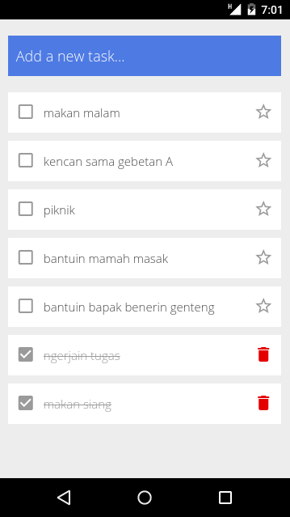

---

## To Run Locally

Make sure [Node.js](https://nodejs.org/) is installed.

Login to [Firebase](https://console.firebase.google.com/) and create a new app from the dashboard.

Click on 'Add Firebase to your web app'

```js
const config = {
  apiKey: "<replace-with-your-config>",
  databaseURL: "<replace-with-your-config>"
};
```

In the firebase dashboard click on Database and then select RULES and change the rules:

```json
{
  "rules": {
    "tasks": {
      ".read": "true",
      ".write": "true"
    }
  }
}
```

### To run the App

Install the node modules.

```bash
$ npm install
```

For iOS

```bash
$ npm run ios
```

For Android

```bash
$ npm run android
```
